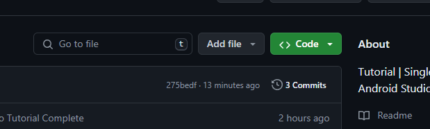
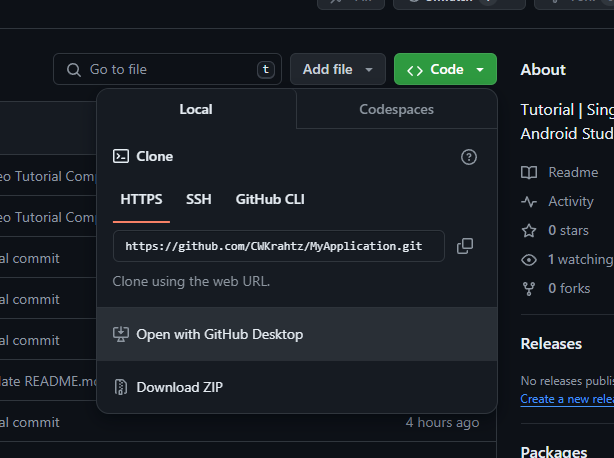
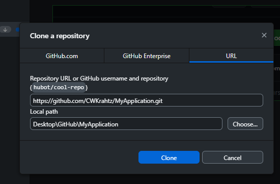

# MyApplication
 Tutorial | Single Screen Application | Android Studio

 To view how I created this Android Application you can follow along with my tutorial video on YouTube, link listed below:
 <ul>
  <li>Single Screen Native Mobile Development Tutorial | Android Studio | CWKrahtz</li>
  <li><a href="">https://youtu.be/5YCVhO7t3ng</a></li>
 </ul>
 
## Using GitHub and GitHub Desktop to clone the repository.

Tip: You also can use GitHub Desktop to clone repositories that exist on GitHub. For more information, see "Cloning and forking repositories from GitHub Desktop."
<ol>
 <li>Sign in to GitHub.com and GitHub Desktop before you start to clone.</li>
  
 <li>On GitHub.com, navigate to the main page of the repository.</li>
   
 <li>Above the list of files, click <b><> Code.</b></li>
    
 
    
 <li>To clone and open the repository with GitHub Desktop, click <b> Open with GitHub Desktop.</b></li>
    
  
    
 <li>Click Choose... and navigate to a local directory where you want to clone the repository.</li>
    
  
    
 <li>Click Clone.</li>
    
</ol>
